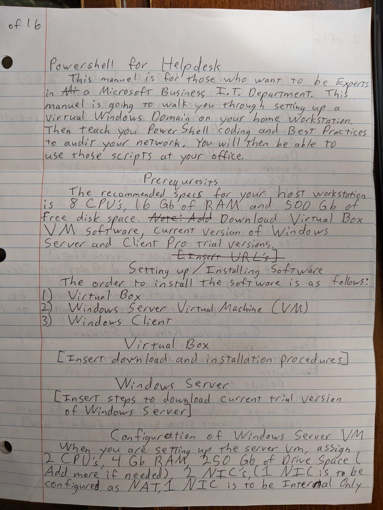
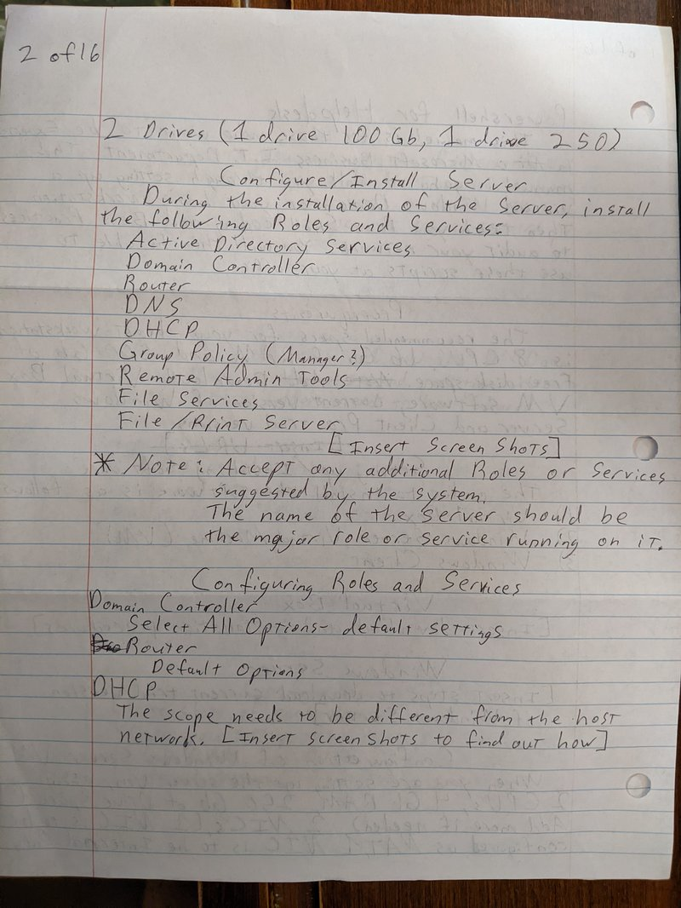
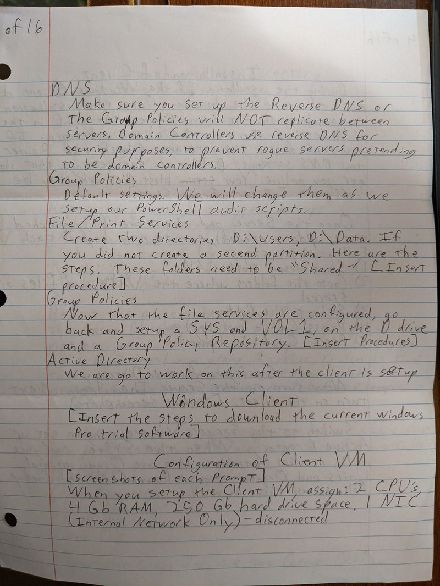
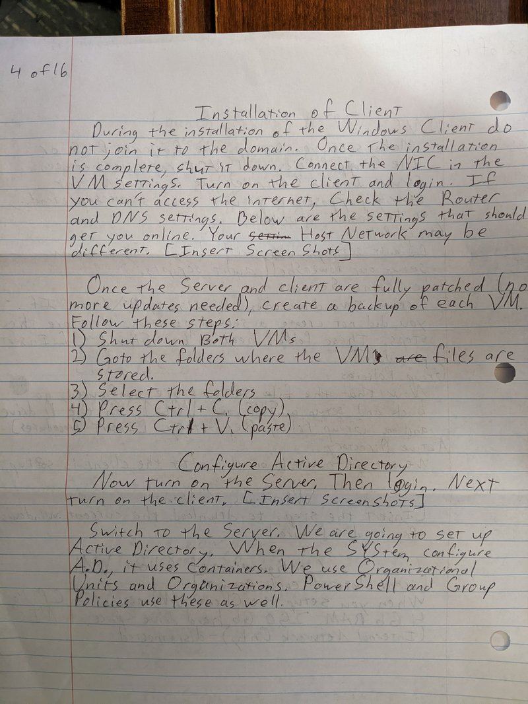
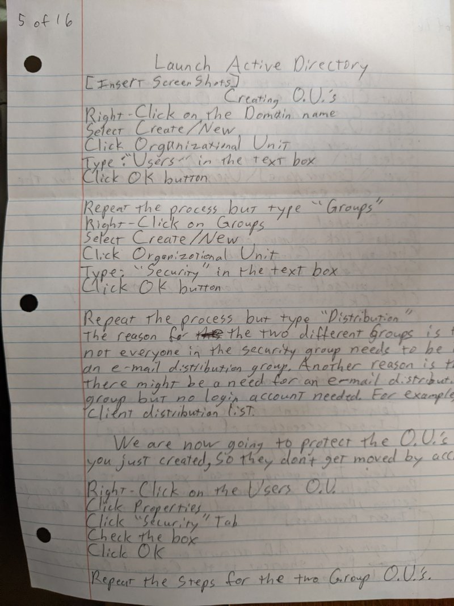
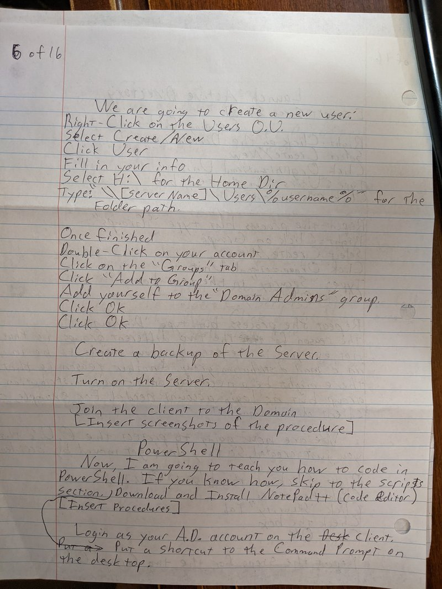
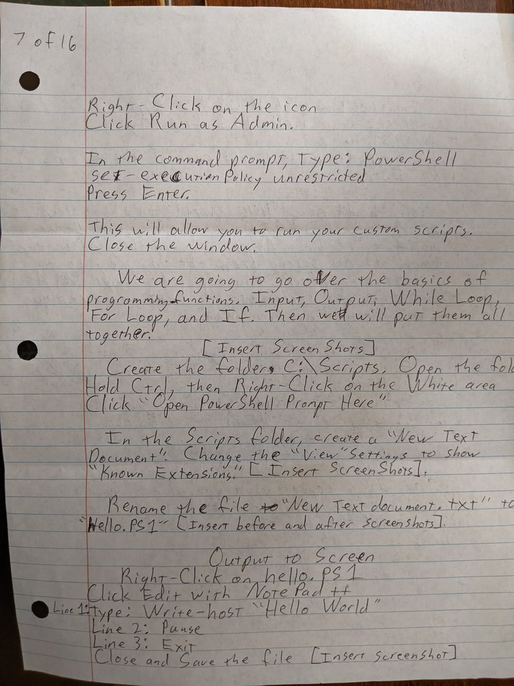
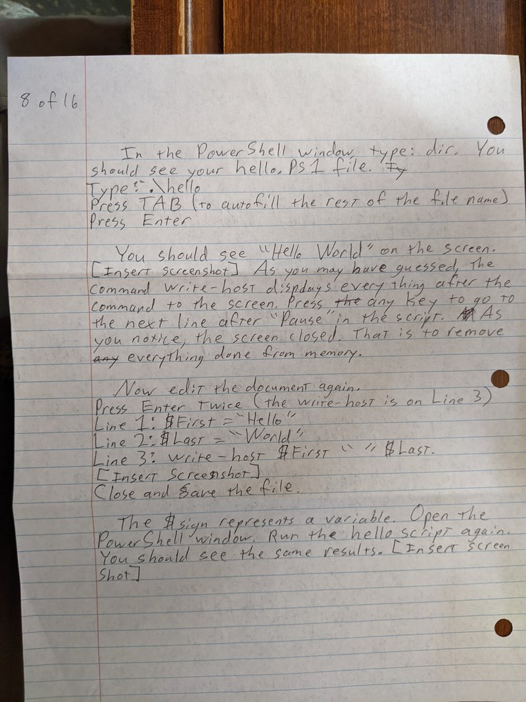

# Chapter 1: Building Your PowerShell Lab Environment

This manual is for aspiring helpdesk and desktop support professionals who want to operate like seasoned administrators in a Microsoft-centric environment. In this chapter you'll build a self-contained lab: a Windows Server domain controller, a Windows client, and the supporting services you need to explore PowerShell-based automation safely.

## What you'll learn

By the end of this chapter, you will have:

- ✅ Installed Oracle VirtualBox and created two virtual machines
- ✅ Deployed Windows Server 2022 as a domain controller with Active Directory, DNS, DHCP, and file services
- ✅ Configured a Windows 11 Enterprise client and joined it to the domain
- ✅ Created an isolated lab network using VirtualBox Internal Networking
- ✅ Built foundational PowerShell skills through hands-on configuration tasks
- ✅ Established a baseline environment for future automation and auditing exercises

## Lab topology

```
Internet
   │
   └─── [Host Workstation]
           │
           ├─── LAB-DC01 (Windows Server 2022)
           │     • IP: 172.16.10.10/24
           │     • Roles: AD DS, DNS, DHCP, File Server
           │     • 2 vCPU, 4 GB RAM, 350 GB storage (2 disks)
           │     • NIC1: NAT (Internet), NIC2: Internal Network (LabNet)
           │
           └─── LAB-WIN11 (Windows 11 Enterprise)
                 • IP: 172.16.10.50-.100 (DHCP)
                 • Domain Member: corp.lab
                 • 2 vCPU, 4 GB RAM, 250 GB storage
                 • NIC1: Internal Network (LabNet)
```

---

## Prerequisites

- **Hardware**: 8 physical or logical CPU cores, 16 GB RAM, and at least 500 GB of free SSD/HDD storage on the host workstation.
- **Virtualisation**: Hardware virtualisation (Intel VT-x/AMD-V) enabled in BIOS/UEFI. Verify from PowerShell:

```powershell
Get-ComputerInfo | Select-Object CsManufacturer,CsModel,HyperVisorPresent
```

- **Operating system**: Windows 10/11 Pro or Enterprise so you can use Hyper-V features if needed. macOS/Linux hosts are fine if the hardware requirements are met.
- **Software**: Oracle VirtualBox, Windows Server 2022 Evaluation ISO, Windows 11 Enterprise Evaluation ISO, and the latest PowerShell (already bundled with Windows 10/11 but install PowerShell 7 for advanced labs).
- **Networking**: At least one spare IPv4 subnet that won't collide with your home LAN (for example `172.16.10.0/24`).

> 💡 **Download checklist**: Create a dedicated `C:\ISO` directory and place every ISO there so you can attach them quickly inside VirtualBox.

---

## Step 1 – Install Oracle VirtualBox

1. Browse to the [VirtualBox Downloads page](https://www.virtualbox.org/wiki/Downloads) and choose **Windows hosts**.
2. Save the installer (for example `VirtualBox-7.x.x-Win.exe`), then right-click and select **Run as administrator**.
3. Accept the default components (VirtualBox Application, USB support, Networking) and continue through the wizard. Allow Windows to install the device drivers when prompted.
4. Reboot the host PC after installation to ensure the VirtualBox network adapters finish binding to the OS.



> 📦 **Command-line install (optional)**: If you prefer automation, run PowerShell as admin and execute:
>
> ```powershell
> winget install --id Oracle.VirtualBox --exact --accept-source-agreements --accept-package-agreements
> ```
>
> The command reboots the network stack, so expect a short connectivity interruption while the installer runs.

---

## Step 2 – Download the operating system media

### Windows Server 2022 Evaluation (Domain Controller)

1. Navigate to [Microsoft Evaluation Center](https://www.microsoft.com/en-us/evalcenter/evaluate-windows-server-2022).
2. Select **ISO** as the download format, sign in with a Microsoft account, and complete the short registration.
3. Choose **English (United States)** unless you have a localisation requirement and download the ISO (approx. 4.5 GB).
4. Rename the ISO to `Windows_Server_2022.iso` and store it in `C:\ISO` for clarity.



### Windows 11 Enterprise Evaluation (Client)

1. Browse to [Evaluate Windows 11 Enterprise](https://www.microsoft.com/en-us/evalcenter/evaluate-windows-11-enterprise).
2. Select **ISO** as the download format, sign in with a Microsoft account, and complete the registration.
3. Choose your language and download the ISO (approx. 5-6 GB).
4. Save the file as `Windows_11_Enterprise.iso` in `C:\ISO`.



---

## Step 3 – Create the Windows Server VM

Launch VirtualBox and create a new virtual machine with the following configuration:

| Setting              | Value                                                                       |
| -------------------- | --------------------------------------------------------------------------- |
| Name                 | `LAB-DC01`                                                                  |
| Type                 | Microsoft Windows                                                           |
| Version              | Windows 2022 (64-bit)                                                       |
| Base memory          | **4096 MB**                                                                 |
| Processors           | **2 vCPU**                                                                  |
| Virtual optical disk | `C:\ISO\Windows_Server_2022.iso`                                            |
| Hard disks           | **SATA Controller** with `LAB-DC01.vdi` at **250 GB dynamically allocated** |

After the VM is created, tweak these advanced settings:

1. **System ▸ Motherboard**: Enable EFI, disable Floppy.
2. **System ▸ Processor**: Enable PAE/NX; leave nested virtualization disabled for now.
3. **Network**:
   - Adapter 1: **NAT** (Internet access for patching).
   - Adapter 2: **Internal Network**, name it `LabNet` (isolated LAN for the domain).
4. **Storage**: Add a second virtual hard disk (`D:`) sized **100 GB** on the same SATA controller.



> 🛠️ **PowerShell shortcut**: Once VirtualBox is installed you can script VM creation. Here's a template to keep for later labs:
>
> ```powershell
> $vmName = "LAB-DC01"
> VBoxManage createvm --name $vmName --ostype "Windows2022_64" --register
> VBoxManage modifyvm $vmName --memory 4096 --cpus 2 --firmware efi --pae on
> VBoxManage createhd --filename "$env:USERPROFILE\VirtualBox VMs\$vmName\$vmName.vdi" --size 256000
> VBoxManage storagectl $vmName --name "SATA" --add sata --controller IntelAhci
> VBoxManage storageattach $vmName --storagectl "SATA" --port 0 --device 0 --type hdd --medium "$env:USERPROFILE\VirtualBox VMs\$vmName\$vmName.vdi"
> VBoxManage storageattach $vmName --storagectl "SATA" --port 1 --device 0 --type dvddrive --medium "C:\ISO\Windows_Server_2022.iso"
> VBoxManage modifyvm $vmName --nic1 nat --nic2 intnet --intnet2 LabNet
> ```

---

## Step 4 – Install Windows Server 2022

1. Start the `LAB-DC01` VM. At the language selection screen accept defaults and choose **Install Now**.
2. Pick **Windows Server 2022 Standard (Desktop Experience)**.
3. Accept the license, choose **Custom: Install Windows only**, and select the 250 GB drive as the OS disk. Leave the 100 GB disk unallocated—we'll initialize it via PowerShell in the next section.
4. Complete the installation, set the Administrator password (record it securely in your lab notebook or password manager), then sign in.



### Post-install configuration

Open PowerShell as Administrator (right-click the Start button → **Windows PowerShell (Admin)**) and run the bootstrap script below to rename the server, configure the IP addresses, and install all roles in one pass:

```powershell
# Get the second network adapter (Internal Network)
$interfaceInternal = Get-NetAdapter | Where-Object {$_.Status -eq 'Up' -and $_.Name -like '*Ethernet*'} | Select-Object -Last 1

# Rename the computer to LAB-DC01
Rename-Computer -NewName 'LAB-DC01' -Force

# Configure static IP on the internal network interface
New-NetIPAddress -InterfaceAlias $interfaceInternal.Name -IPAddress 172.16.10.10 -PrefixLength 24 -DefaultGateway 172.16.10.1

# Point DNS to localhost (this server will be the DNS server)
Set-DnsClientServerAddress -InterfaceAlias $interfaceInternal.Name -ServerAddresses 127.0.0.1

# Install server roles and features
Install-WindowsFeature AD-Domain-Services, DHCP, DNS, File-Services, Print-Services, RSAT-AD-Tools, GPMC, Routing -IncludeManagementTools
Install-WindowsFeature FS-FileServer, FS-DFS-Namespace, FS-DFS-Replication

# Restart to apply the computer name change
Restart-Computer
```

> 🔐 **Why static IP first?** Domain controllers rely on consistent addressing. Configuring DNS to point to itself ensures the AD DS installation can register service records successfully.

### Prepare storage for shares and SYSVOL

After the reboot, sign back in and open PowerShell as Administrator:

```powershell
# Initialize the second disk (100 GB) and format as NTFS
Initialize-Disk -Number 1 -PartitionStyle GPT
New-Partition -DiskNumber 1 -DriveLetter D -UseMaximumSize | Format-Volume -FileSystem NTFS -NewFileSystemLabel 'Data'

# Create directories for user home folders and shared data
New-Item -Path 'D:\Users' -ItemType Directory
New-Item -Path 'D:\Data' -ItemType Directory
```

Create network shares with proper permissions:

```powershell
# Create Users share (accessible only by Domain Admins for now)
New-SmbShare -Name "Users" -Path "D:\Users" -FullAccess "LAB-DC01\Domain Admins"

# Create Data share (Domain Admins have full control, Domain Users can modify)
New-SmbShare -Name "Data" -Path "D:\Data" -FullAccess "LAB-DC01\Domain Admins" -ChangeAccess "LAB-DC01\Domain Users"
```



---

## Step 5 – Promote the server to a domain controller

Configure Active Directory Domain Services and create the new forest:

```powershell
Install-ADDSForest -DomainName "corp.lab" -DomainNetbiosName "CORP" -SafeModeAdministratorPassword (Read-Host -AsSecureString 'DSRM Password') -Force
```

The server restarts automatically. Sign back in when prompted and ensure the NIC configuration still reflects the `172.16.10.x` address.



### Configure DNS and reverse lookup zone

```powershell
# Create reverse lookup zone for the lab network
Add-DnsServerPrimaryZone -NetworkId "172.16.10.0/24" -ReplicationScope "Forest"

# Add PTR record for the domain controller
Add-DnsServerResourceRecordPtr -Name "10" -ZoneName "10.16.172.in-addr.arpa" -PtrDomainName "LAB-DC01.corp.lab"
```

> 📘 **Note**: Reverse DNS is essential for domain controllers. Group Policy replication and other AD services use PTR records to verify server identity and prevent rogue servers from joining the domain.

### Configure DHCP scope (isolated lab network)

```powershell
# Authorize this DHCP server in Active Directory
Add-DhcpServerInDC -DnsName "LAB-DC01.corp.lab" -IpAddress 172.16.10.10

# Create a DHCP scope for client machines (.50-.100 range)
Add-DhcpServerv4Scope -Name "Lab Clients" -StartRange 172.16.10.50 -EndRange 172.16.10.100 -SubnetMask 255.255.255.0

# Configure DHCP options (DNS domain, DNS server, default gateway)
Set-DhcpServerv4OptionValue -DnsDomain "corp.lab" -DnsServer 172.16.10.10 -Router 172.16.10.1
```

> ✅ **Scope design tip**: Keep DHCP leases away from statically-assigned addresses (DC, future servers). Reserving `.1-.49` for infrastructure gives you room to grow.

### Create initial OU structure

```powershell
# Create top-level organizational unit
New-ADOrganizationalUnit -Name "Corp" -Path "DC=corp,DC=lab"

# Create sub-OUs for different resource types
New-ADOrganizationalUnit -Name "Servers" -Path "OU=Corp,DC=corp,DC=lab"
New-ADOrganizationalUnit -Name "Workstations" -Path "OU=Corp,DC=corp,DC=lab"
New-ADOrganizationalUnit -Name "Service Accounts" -Path "OU=Corp,DC=corp,DC=lab"
```

Verify the OU structure in **Active Directory Users and Computers** (dsa.msc):

```powershell
# Open Active Directory Users and Computers
dsa.msc
```



> 📘 **Next chapter preview**: We'll populate the central store with baseline PowerShell-driven audit policies once the client is joined to the domain.

---

## Step 6 – Build the Windows 11 Client VM

Create another VM in VirtualBox with the following profile:

| Setting     | Value                                                                                                |
| ----------- | ---------------------------------------------------------------------------------------------------- |
| Name        | `LAB-WIN11`                                                                                          |
| Type        | Microsoft Windows                                                                                    |
| Version     | Windows 11 (64-bit)                                                                                  |
| Base memory | **4096 MB**                                                                                          |
| Processors  | **2 vCPU**                                                                                           |
| Display     | Enable 3D acceleration for a smoother UI                                                             |
| Network     | Adapter 1 = **Internal Network (LabNet)** (leave **cable disconnected** box ticked for installation) |
| Storage     | 250 GB dynamically allocated VDI + `Windows_11_Enterprise.iso` mounted                                      |


### Install Windows 11

1. Power on `LAB-WIN11`, choose language preferences, then select **I don't have a product key**.
2. Pick **Windows 11 Enterprise**, accept the licence, and choose **Custom: Install Windows only**.
3. Install onto the available disk and complete the OOBE. When prompted to connect to the network, keep the adapter disconnected so you can create a local administrator account.
4. Once the desktop loads, install the VirtualBox Guest Additions for better drivers (Devices ▸ Insert Guest Additions CD Image).

> 🔐 **Privacy hint**: During OOBE, decline sending diagnostic data and disable optional advertising IDs to keep the lab clean.

### Patch and capture the clean state

1. Shut down the VM, edit network settings to **reconnect** the Internal adapter (`LabNet`).
2. Boot the VM and configure the IP stack to use DHCP (default). Verify it receives an address from the server by running:

```powershell
# Display network configuration (should show DHCP assigned from 172.16.10.50-.100 range)
ipconfig /all

# Test connectivity to the domain controller
Test-Connection -ComputerName 172.16.10.10 -Count 4
```

3. Run **Settings ▸ Windows Update** until no additional patches remain.
4. Install PowerShell 7 for advanced scripting capabilities:

```powershell
# Install PowerShell 7 using winget
winget install --id Microsoft.PowerShell --accept-package-agreements --accept-source-agreements
```

5. Create a VM snapshot in VirtualBox labelled `Baseline Patched` so you can revert quickly during experiments (Machine ▸ Take Snapshot).


---

## Step 7 – Back up your virtual machines

Maintaining golden images saves hours of rebuild time. Follow this workflow after large configuration milestones:

1. Shut down both `LAB-DC01` and `LAB-WIN11` cleanly (`Start ▸ Power ▸ Shut down`).
2. In File Explorer browse to the VirtualBox VM folder (default `C:\Users\<you>\VirtualBox VMs`).
3. Copy each VM directory to an external drive or a `backups\chapter_1` folder, keeping the folder names intact.
4. Compress the copies (`Right-click ▸ Send to ▸ Compressed (zipped) folder`) to save space.

For scripted backups, from an elevated PowerShell session run:

```powershell
# Define source and destination paths with date stamp
$source = "$env:USERPROFILE\VirtualBox VMs"
$dest = "D:\VMBackups\$(Get-Date -Format 'yyyyMMdd')"

# Create backup directory
New-Item -Path $dest -ItemType Directory -Force | Out-Null

# Copy VM folders (this may take 10-20 minutes depending on disk speed)
Write-Host "Backing up LAB-DC01..." -ForegroundColor Cyan
Copy-Item -Path "$source\LAB-DC01" -Destination $dest -Recurse

Write-Host "Backing up LAB-WIN11..." -ForegroundColor Cyan
Copy-Item -Path "$source\LAB-WIN11" -Destination $dest -Recurse

Write-Host "Backup complete: $dest" -ForegroundColor Green
```

---

## Step 8 – Initial Active Directory tasks

With both VMs running and fully patched:

1. Sign into `LAB-DC01` as `CORP\Administrator`.
2. Open **Active Directory Users and Computers** and confirm the OU structure created earlier exists.
3. Create a helpdesk admin account via PowerShell:

```powershell
# Create a user account for lab testing
New-ADUser -Name "LAB Helpdesk" -SamAccountName "lab.helpdesk" -UserPrincipalName "lab.helpdesk@corp.lab" -AccountPassword (Read-Host -AsSecureString 'Password') -Enabled $true -Path "OU=Workstations,OU=Corp,DC=corp,DC=lab"

# Add the account to Domain Admins group for administrative access
Add-ADGroupMember -Identity "Domain Admins" -Members "lab.helpdesk"
```

4. Join the client to the domain (on `LAB-WIN11`, run PowerShell as Administrator):

```powershell
# Join the computer to the corp.lab domain
Add-Computer -DomainName corp.lab -Credential corp\Administrator -Restart
```

When prompted, enter the domain administrator password.

5. After the reboot, sign in with `corp\lab.helpdesk` and verify network shares are accessible:

```powershell
# Test access to the Data share
Test-Path \\LAB-DC01\Data

# View active SMB connections
Get-SmbConnection

# Map the Data share as a network drive (optional)
New-PSDrive -Name "Z" -PSProvider FileSystem -Root "\\LAB-DC01\Data" -Persist
```

You're now ready to begin authoring PowerShell audit scripts and Group Policy baselines in the next chapter.

---

## Verification checklist

Before moving to the next chapter, verify your lab environment:

```powershell
# On LAB-DC01, run these verification commands:

# Check domain controller status
Get-ADDomainController

# Verify DNS is responding
nslookup LAB-DC01.corp.lab

# Test reverse DNS lookup
nslookup 172.16.10.10

# Check DHCP scope status
Get-DhcpServerv4Scope

# Verify Active Directory replication
repadmin /replsummary

# List all domain users
Get-ADUser -Filter * | Select-Object Name, SamAccountName
```

---

## Troubleshooting quick hits

- **VM won't start**: Ensure Hyper-V is disabled (`OptionalFeatures.exe` → uncheck Hyper-V) when using VirtualBox on Windows hosts. A system reboot is required after disabling Hyper-V.
- **No DHCP lease on client**: Confirm Adapter 2 on `LAB-DC01` is set to `LabNet` in VirtualBox settings. Restart the `DHCP Server` service (`Restart-Service DHCPServer`) and run `ipconfig /renew` on the client.
- **DNS resolution fails**: Run `dcdiag /test:dns /v` on the server; check that the reverse lookup zone exists and contains PTR records. Verify the DNS service is running: `Get-Service DNS`.
- **Domain join fails**: Ensure the client can ping `172.16.10.10` and resolve `corp.lab`. Check the client's DNS settings point to `172.16.10.10`.
- **Slow performance**: Reduce the screen resolution inside the VMs, assign more RAM (but keep at least 6–8 GB for the host OS), and enable 2D/3D acceleration in VirtualBox display settings. Close unnecessary applications on the host.

---

Next up: we will craft reusable PowerShell functions to audit Active Directory, build compliance reports, and deploy them via Group Policy.
